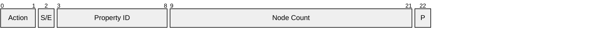
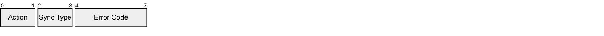
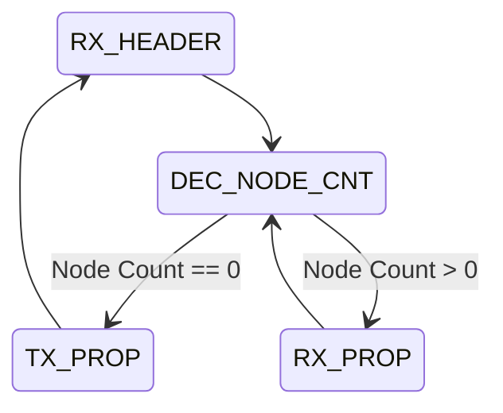
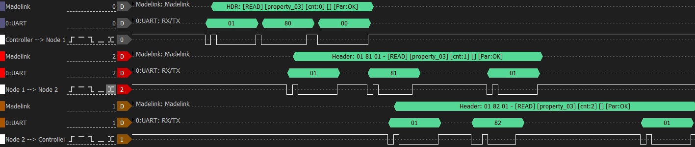
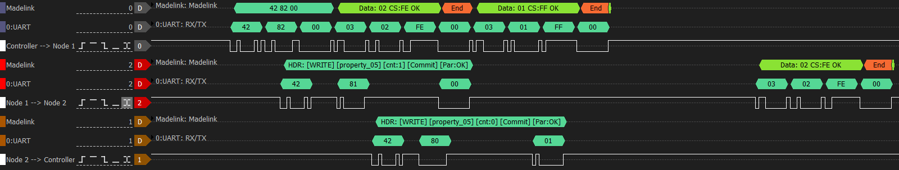
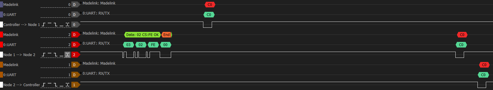
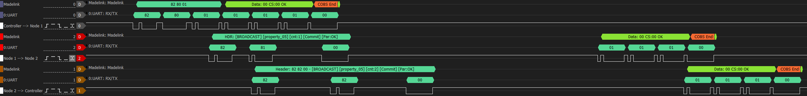

# madelink 🌼🔗

Madelink is a daisy-chainable master-slave protocol using serial communication (UART) for connecting multiple microcontroller-based devices.

Madelink is a portmanteau of "madeliefje" (Dutch for daisy) and "link" (part of a chain). 

The protocol is originally designed as part of the [OpenFlap](https://github.com/ToonVanEyck/OpenFlap) project to connect a single controller to multiple nodes over a single serial bus. As such the the master is implemented to be used as part of an RTOS-based system, while the slaves are implemented to run on bare-metal microcontrollers.

## Features
- Daisy chain
- Master-slave protocol
- Read / Write / Broadcast support
- Error checking
- Dynamic data lengths 
- No dynamic memory allocation
- Automatic chain length detection

The main use case for Madelink is to connect multiple microcontroller-based sensor or actuator nodes to a single controller over a single serial bus. Communication can only be initiated by the master device.

The protocol is designed in such a way that a node can process and retransmit a byte as soon as it receives it. This allows for low-latency communication even when multiple nodes are connected in a daisy chain.

## Protocol Overview

Each message starts with a 3 byte header followed by a number of [COBS](https://en.wikipedia.org/wiki/Consistent_Overhead_Byte_Stuffing) encoded payloads. A shorter one byte header also exists for special messages.

Data transfers are spoken to in terms of "properties". Each property has a unique property ID and may have a variable length. A property may contain multiple data fields, this is up to the implementation of the property handlers within the master and slave devices. But a property must always be written and read as a whole.

e.g.: An LED may have a color property containing three fields (R, G, B), while a temperature sensor may have a single field property containing the temperature value.

The maximum property length is defined by `MDL_PROPERTY_SIZE_MAX` (default: 254 bytes).

A total of 64 properties are supported (property IDs 0-63) and (theoretically) up to 8192 slaves can be connected in a daisy chain.

### Header format

2 Types of headers exist: a standard 3 byte header for regular messages and a shorter 1 byte header for synchronization messages.

Both headers start with a 2 bit action field, defining the type of message being sent.

| Action    | Value | Description                                                                |
|-----------|-------|----------------------------------------------------------------------------|
| READ      | 0     | Read property data from all nodes.                                         |
| WRITE     | 1     | Write (different) property data to all nodes.                              |
| BROADCAST | 2     | Broadcast / Write (the same) property data to all nodes.                   |
| SYNC      | 3     | Synchronization action used for error checking and committing staged data. |

#### Standard header:

Used when the action is READ, WRITE or BROADCAST.

**S/E**: This bit has a different meaning depending on the action:

- READ: Error bit, Indicate that we want want to read the error states of the nodes instead of the property data. The property ID field is ignored in this case and should be zero.

- WRITE / BROADCAST: Staged bit, Indicate that the data being written should be staged and only committed when a SYNC action is received. This is useful for writing multiple properties to multiple nodes and ensuring that all nodes commit the changes at the same time. E.g.: making sure that multiple servos move simultaneously.

**Property ID**: The ID of the property to read or write.

**Node Count**: This field will be modified by each node which retransmits it. It has a slightly different behavior depending on the action:

- READ / BROADCAST: The master sets a node count of zero. Each slave increments the node count by one when it retransmits the message. When the message returns to the master, the node count indicates how many nodes are present in the chain.

- WRITE: The master sets the node count to the total number of nodes in the chain. Each slave decrements the node count by one when it retransmits the message. When the message returns to the master, the node count should be zero.

**P**: Parity bit for error checking. This bit is set such that the total number of 1 bits in the header (including the parity bit) is even.

#### Sync header:

Used when the action is SYNC.

**Sync Type**: Defines the type of synchronization action being performed.

| Sync Type | Value | Description                                                |
|-----------|-------|------------------------------------------------------------|
| ACK       | 0     | Check if an error has occurred on any node.                |
| COMMIT    | 1     | Commit all staged data on all nodes.                       |

**Error Code**: Used when the Sync Type is ACK. If this byte is non-zero, it indicates that one or more nodes have reported an error. The specific error codes are implementation-defined. The master can use the read action with the error bit set to query the exact error code and the state in which it occurred from each node.

### Payload format

Each property data payload is COBS encoded, the last byte of each encoded payload is a checksum byte. The sum of all bytes including the checksum should be equal to zero (modulo 256).

### The READ action

The master starts the transmission by sending a READ message header with node count zero. Each node increments the node count by one when it retransmits the message. Internally the node decrements the node count before retransmitting the payload of the previous node.

When it's internal node count reaches zero, the node knows it is its turn to send its property data. It reads the requested property, encodes it using COBS, appends the checksum byte and transmits it.

When the message returns to the master, the node count indicates how many nodes are present in the chain. And how many payloads to expect.

#### State Diagram

#### Example

This example shows a master reading property 0x03 from a chain of two nodes. We read 0x00 from the first node and 0x01 from the second node.

**1. The master sends the READ header with node count 0.**

We can clearly see each node increments the node count by one and the header bytes are forwarded before the node has received the complete header.

**2. Nodes respond with their property data.**

Here we see how each node appends its property data in order. The first node immediately starts transmitting its property data after forwarding the header. The second node waits for the first node's property data to be completely forwarded before it starts transmitting its own property data.

In this example the payload is a single byte, an extra CS byte is added. In this case 2 bytes are required for the COBS encoding, making the total payload length 4 bytes.

### The WRITE action

The master starts the transmission by sending a WRITE message header with the total number of nodes in the chain as the node count. Each node decrements the node count by one when it retransmits the message. The master then transmits the property payloads for each node in the chain, starting at the data for the last node in the chain. If the master does not have data for a specific node, it transmits a 0x00 byte which is an empty COBS encoded payload.

Each time a node receives a payload, it decrements the node count it received in the header. When the internal node count reaches zero, the node knows it is its turn to read its property data. It decodes the received payload, verifies the checksum and writes the property data. 

If the staging bit was not set in the header, the node immediately commits the data. Otherwise it waits for a SYNC COMMIT action from the master. 

When the message returns to the master, the node count should be zero and no payloads more property payloads should be received by the master.

#### Example

This example shows a master writing property 0x05 to a chain of two nodes. 0x01 is written to node 1 and 0x02 to node 2.

The master writes the header with node count 2, each node decrements the node count by one. The master then transmits the property payloads for each node in reverse order. Each node writes its property data when its internal node count reaches zero. We can see the payload for the second node (Data: 02) is being retransmitted by the first node. We don't see the payload for the first node (Data: 01) being retransmitted as it is consumed by the first node.
The second node only retransmits the header as it is the last node in the chain.

When the master finished writing the property data, it can send a SYNC ACK message to check if any node reported an error during the write operation. The node will not retransmit this sync header until it has finished writing the property data. When an error occurs, the node sets the error code field in the header to a non-zero value. The master can then use the READ action with the error bit set to query the exact error code and the state in which it occurred from each node.

### The BROADCAST action

The master starts the transmission by sending a BROADCAST message header with node count zero. Each node increments the node count by one in a similar way as with the READ action. The master then transmits a single property payload which is intended for all nodes in the chain. The payload is retransmitted by each node until it returns to the master. 

If the staging bit was not set in the header, the node immediately commits the data. Otherwise it waits for a SYNC COMMIT action from the master. 

#### Example

This example shows the master brodadcasting property 0x05 with data 0x00 to a chain of two nodes.

Here we can see the header being forwarded in the same way as with the READ action. The master then transmits the property payload which is retransmitted by each node in the chain.

### The SYNC action

#### ACK Sync Type

The master starts the transmission by sending a SYNC ACK message header. Each node checks if it has any error state to report. If so, it sets the error code field in the header to a non-zero value. The message is retransmitted by each node until it returns to the master. If the error code field is non-zero when it returns to the master, it indicates that one or more nodes have reported an error. 

The master can then use the READ action with the error bit set to query the exact error code and the state in which it occurred from each node.

#### COMMIT Sync Type

The master starts the transmission by sending a SYNC COMMIT message header. The header is retransmitted by the node and the node commits the staged data. The message continues to be retransmitted until it returns to the master.